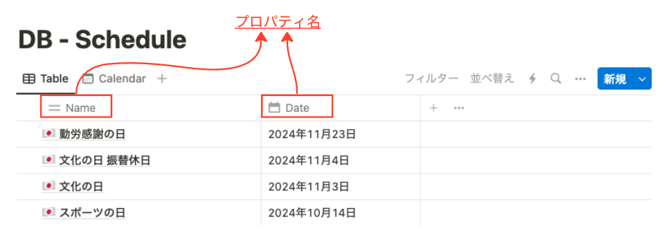
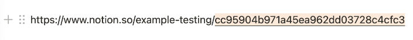

# Notion に日本の祝日をインポート

Node.js スクリプトを利用し、Notion のデータベースに新しいページ（祝日）を追加することができます。


## 環境

- Node.js v20.11.0
- [Notion API](https://developers.notion.com/)
- [Holidays JP API](https://holidays-jp.github.io/)

## 使い方

1. [Getting started](https://developers.notion.com/docs/create-a-notion-integration#getting-started) に従って以下の手順をを実行し、Notion の統合を作成する

   - Create your integration in Notion
   - Get your API secret
   - Give your integration page permissions

2. リポジトリを clone し、依存関係をインストールする

   ```bash
   npm install
   ```

3. .env.example をコピーし、.env を作成する

   - NOTION_KEY：新しく作成した統合の API キー
   - NOTION_PAGE_ID：データベースが存在する Notion ページの ID

4. 自身の Notion データベースのプロパティ名に修正する

   `import-japanese-holidays.js`

   ```js
    await notion.pages.create({
        parent: {
          type: "database_id",
          database_id: databaseId,
        },
        properties: {
            Name: { // プロパティ名
                title: [],
            },
            Date: { // プロパティ名
                date: {},
            },
   ```

5. スクリプトを実行する

   ```bash
   node import-japanese-holidays.js
   ```

## 注意

- **Notion のプロパティ**

  詳細は [Notion Page properties](https://developers.notion.com/reference/page-property-values) を参照ください。

    

- **Notion のページ ID**

  ページ ID は、ページ URL の末尾にある 32 文字の文字列です。

  

- **作成されるデータ**

  現在の西暦の祝日データを取得し、それを Notion に追加します。

## ライセンス

このスクリプトでは、[🎌 Holidays JP API](https://holidays-jp.github.io/) - [MIT License](https://github.com/holidays-jp/api/blob/master/LICENCE) を利用しています。
